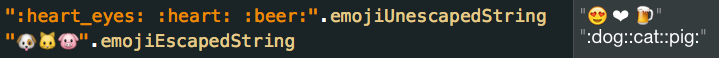

# emoji-swift



`String` extension converting to and from emoji character and [Emoji Cheat Sheet](http://www.emoji-cheat-sheet.com/) string.

[](https://travis-ci.org/safx/emoji-swift)
<!--


-->

## Example Usage

```swift
import Emoji

":heart_eyes: :heart: :beer:".emojiUnescapedString
"🐶🐱🐷".emojiEscapedString
```

## Methods

```swift
extension String {
    var emojiEscapedString: String
    var emojiUnescapedString: String
    static var emojiDictionary : [String:String]
}
```

## Install

```
pod 'Emoji-swift'
```
